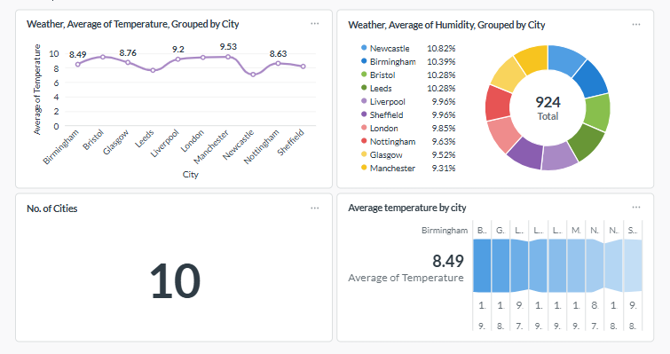

🌦️ Weather Data Pipeline

Project Description: The Weather Data Pipeline project fetches daily weather data for selected UK cities using the OpenWeatherMap API, stores it in a PostgreSQL database, orchestrates the process using Apache Airflow, and visualizes the data with Metabase. Everything runs in isolated containers using Docker Compose for easy setup.

🛠️ Tech Stack

- Apache Airflow: For ETL orchestration and scheduling.
- PostgreSQL: For structured data storage.
- Docker Compose: To run all services together in containers.
- Metabase: For interactive dashboards and data visualization.
- pgAdmin: For easy database management.

🚀 Features

- Fetches daily weather data for multiple cities using latitude and longitude.
- Stores data in a normalized PostgreSQL schema.
- Automates and schedules data pipelines with Airflow.
- Allows easy customization of cities and date ranges.
- One-command setup using Docker Compose.
- Visualizes weather data with clean and interactive dashboards via Metabase.

## 📊 Dashboards (Metabase)

The project includes interactive dashboards built using Metabase to visualize real-time UK weather data.

### UK Realtime Weather Dashboard


The dashboard shows:
- Average temperature by city
- Average humidity by city
- Total number of monitored cities
- City-level comparisons and insights

🧱 Project Structure

- `dags/` → Contains Airflow DAGs and the main ETL script.
- `postgres/` → Contains `init.sql` for initializing the database.
- `docker-compose.yml` → Runs all services (Airflow, Postgres, pgAdmin, Metabase).
- `.env` → Stores sensitive variables such as passwords and API key.

🧪 Setup Instructions

1. Clone the repository:

```bash
git clone https://github.com/hasnasaad22/weather-data-pipeline.git
cd weather-data-pipeline
Create a .env file and update credentials:

cp .env.example .env
Then open .env and add your passwords and OpenWeatherMap API key.

Start the services:

docker compose up -d
Access the services:

Airflow Webserver: http://localhost:8080

pgAdmin: http://localhost:5050

Metabase: http://localhost:3000

Log in using the credentials set in your .env file. Run DAGs in Airflow, query data in pgAdmin, and visualize it in Metabase.

✅ Notes

Ensure Docker and Docker Compose are installed before running.

You can easily modify DAGs or add new cities.

All data persists safely in PostgreSQL even if containers are stopped.

🙏 Credits
Original project inspiration: chiranjeevi-sagi/weather-data-pipeline

OpenWeatherMap API: https://openweathermap.org/api

Metabase for visualization: https://www.metabase.com

PostgreSQL for database management: https://www.postgresql.org