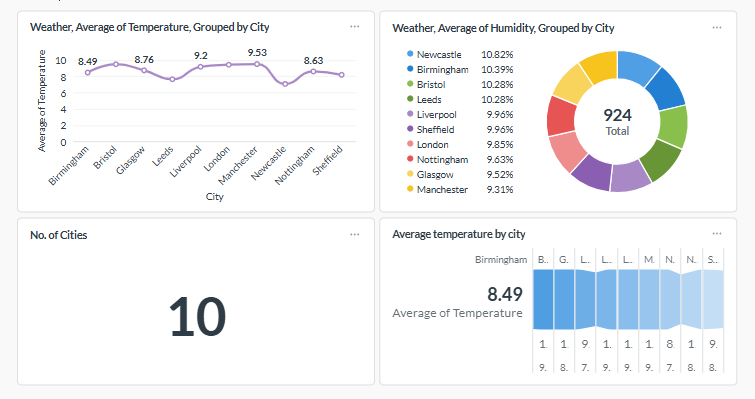

# 🌦️ Weather Data Pipeline

## Project Description
An end-to-end data engineering pipeline that collects daily weather data for UK cities using the OpenWeatherMap API, stores it in PostgreSQL, orchestrates workflows with Apache Airflow, and visualizes insights using Metabase — all fully containerized with Docker Compose.

## 🛠️ Tech Stack

- **Apache Airflow** → Workflow orchestration & scheduling  
- **PostgreSQL** → Data storage layer  
- **Docker Compose** → Containerized environment  
- **Metabase** → Data visualization & dashboards  
- **pgAdmin** → Database management  

## 🚀 Features

- Automated daily weather data ingestion  
- Scalable ETL pipeline using Airflow DAGs  
- Normalized PostgreSQL schema  
- Easy configuration for cities and parameters  
- One-command full environment setup  
- Interactive dashboards for analysis 

## 📊 Dashboards (Metabase)

Interactive dashboards built using Metabase to visualize real-time UK weather data.

### UK Realtime Weather Dashboard


### Key Insights
- Average temperature per city  
- Average humidity per city  
- City comparison analytics  
- Total monitored cities  

## 🧱 Project Structure

- `dags/` → Airflow DAGs and ETL scripts  
- `postgres/` → Database initialization (`init.sql`)  
- `docker-compose.yml` → Runs all services  
- `.env` → Environment variables (API keys, credentials)  

## 🧱 Architecture

The pipeline follows a simple ETL workflow:

OpenWeatherMap API → Apache Airflow DAGs → PostgreSQL Database → Metabase Dashboards

## 🧪 Setup Instructions

1. **Clone the repository:**

```bash
git clone https://github.com/hasnasaad22/weather-data-pipeline.git
cd weather-data-pipeline
```

2. **Create a `.env` file and update credentials:**

```bash
cp .env.example .env
# Then open .env and add your passwords and OpenWeatherMap API key
```


3. **Start all services:**

```bash
docker compose up -d
```

4. **Access the services:**

- **Airflow Webserver**: [http://localhost:8080](http://localhost:8080)  
- **pgAdmin**: [http://localhost:5050](http://localhost:5050)  
- **Metabase Dashboard**: [http://localhost:3000](http://localhost:3000)

Log in using the credentials set in your `.env` file. Run DAGs in Airflow, query data in pgAdmin, and visualize it in Metabase.

## ✅ Notes

- Ensure Docker and Docker Compose are installed
- DAGs can be modified or extended for more cities
- All data persists safely in PostgreSQL even if containers are stopped.

## 🙏 Credits
 
- OpenWeatherMap API: [https://openweathermap.org/api](https://openweathermap.org/api)  
- Metabase for visualization: [https://www.metabase.com](https://www.metabase.com)  
- PostgreSQL for database management: [https://www.postgresql.org](https://www.postgresql.org)

